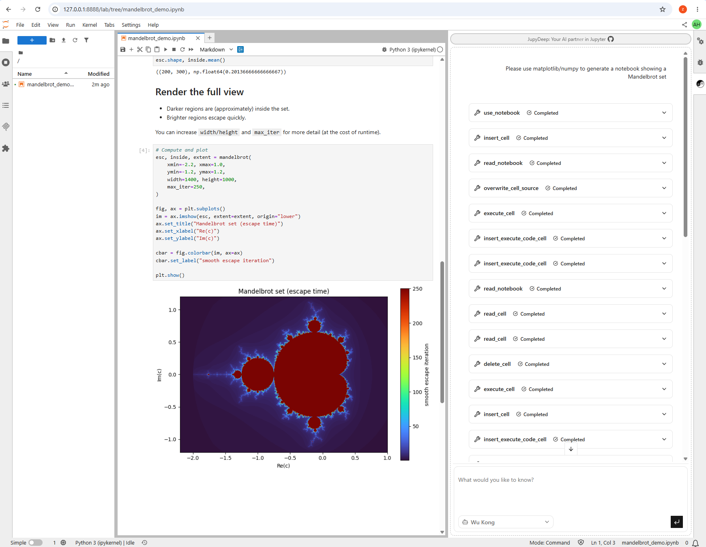
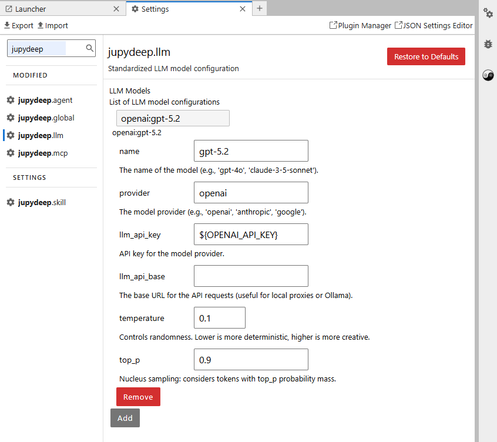
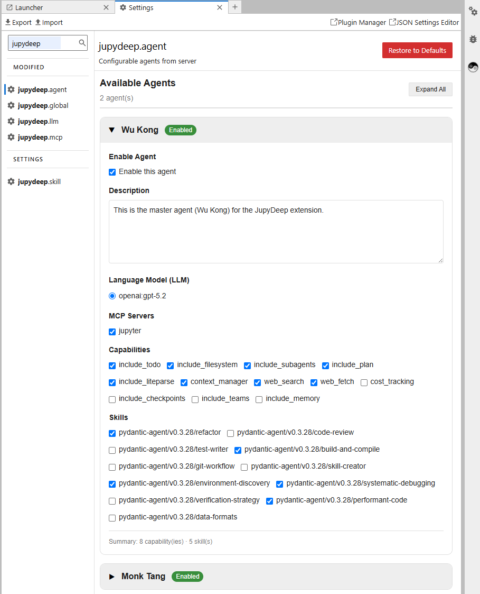

# JupyDeep: Your AI partner in Jupyter

[](https://github.com/yezhenqing/jupydeep/actions/workflows/build.yml)

**JupyDeep** is an AI-native extension for JupyterLab, your always-on intelligent partner powered by Pydantic AI/Agents and beyond.

<!--

-->
<div align="center">

</div>

JupyDeep bridges the gap between large language models and complex, high-performance data analysis workflows. By integrating an intelligent agent engine directly into the Jupyter ecosystem, it transforms your standard workspace into a reactive, collaborative, and AI-assisted environment. Crucially, instead of piping your Jupyter context to external third-party services, JupyDeep is designed to embed AI agents as native citizens within your local Jupyter environment. With it, you can configure diverse agents by simply binding them to specific MCP tools, custom skills, and a wide array of underlying features.

> ⚠️ **Note:** JupyDeep is an active proof of concept under rapid development. Because its underlying foundation—including Pydantic AI/Agents—is also evolving quickly, unexpected issues may arise. We appreciate your patience as we lay the groundwork for a mature future.

## 🗺️ Roadmap / Upcoming Features

- **Conversation Persistence & Checkpoint Rewind** (State management)
- **Multimodal Capabilities** (Voice, images, and visual reasoning)
- **Collaborative AI Workspaces** (Multi-user shared sessions)
- **Cross-Domain Data Analysis Demos** (Bioinformatics, network algorithm, etc.)
- **And much more...**

Please visit our [Documentation](https://yezhenqing.github.io/jupydeep/) for installation, guides, examples, and more (link coming soon).

## 🚀 Getting Started

Please install it via pip or uv first (here we use uv as an example)

```bash
  uv init
  uv add jupyterlab jupydeep
```

Then simply launch JupyterLab as below

```bash
  uv run jupyter lab
```

After installing **JupyDeep** for the first time, you'll need to configure a few settings to get the engine running:

1. **Locate Settings:** Open the JupyterLab Settings Editor and look for the options prefixed with `jupydeep`.
2. **Configure Your LLM (Required):** Naturally, the agent engine cannot function without an LLM backend. Set up your model provider by following this schema (for example):

<!--

-->
<div align="center">

</div>

3. **Meet Your Built-in Agents:** Once your LLM is connected, two default agents will instantly populate your `jupydeep.agent` panel:
   - 🐵 **Wu Kong:** Built for heavy-lifting code execution and technical problem-solving.
   - 🐴 **Monk Tang:** Built for high-level tactical planning and orchestration.
     <!--
     
     -->
     <div align="center">
     
     </div>

> 💡 **Go Beyond the Defaults:** You can easily tweak their skillsets or register your own custom agents in the workspace. Head over to our [Documentation](https://yezhenqing.github.io/jupydeep/) for the full customization guide. If the agents aren't visible, try refreshing the page; that might help.

## 🤝 Contributing

We welcome all forms of contributions—whether it's fixing bugs, improving documentation, or proposing new functionality.

### Local Development Setup

JupyDeep consists of a Python backend (`Hatch` / `uv`) and a TypeScript-based JupyterLab frontend extension (`yarn` / `jlpm`). Follow the steps below to set up your local development environment:

**Clone the repository:**

```bash
git clone https://github.com/yezhenqing/jupydeep.git
cd jupydeep
```

**Install dependencies and create a virtual environment**:

We highly recommend using uv for fast and robust package and environment management:

```
uv sync
uv pip install -e .
```

Since JupyDeep adheres to standard JupyterLab architecture, please refer to the official JupyterLab Extension Examples for detailed frontend compilation (jlpm build, jlpm watch) and source extension link workflows.

## ✨ Acknowledgments

### Open-Source Credits

JupyDeep is built upon exceptional open-source projects, including the Jupyter ecosystem, Pydantic AI/Agents, and jupyter-mcp-server/tools from Datalayer, among others. We extend our deepest gratitude to all the creators and contributors who made this work possible.

### AI Disclosure / Development Statement

AI was used primarily as a conversational sounding board for debugging; all core architecture and code logic remain purely human-authored.
